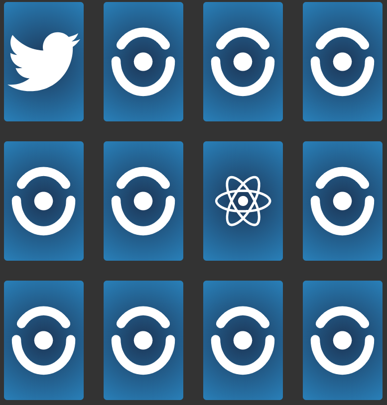

# Memory-game 🎲

> <h2>📚 About </h2>

 

A simple memory game for the sole purpose of training programming logic using Js

 

 
Using only Js , html and css I made this little game with the objective of training.

 
Don't look for good practices in this project, the goal was to train programming logic.

  

> <h2>🔍 here you will find</h2>
>  

<ul>
<li>JavaScript</li>
<li>Html</li>
<li>Css</li>
</ul>

 

 
 

 
 

 
 

